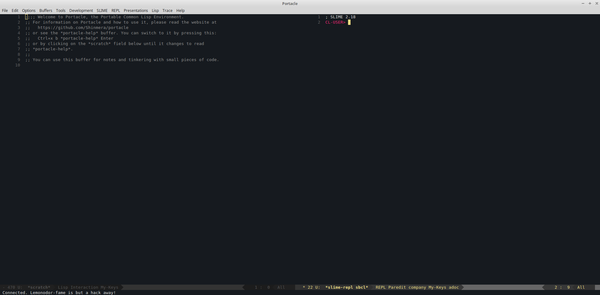

## Emacs

[SLIME](https://github.com/slime/slime/) é o Superior Lisp
Interaction Mode for Emacs. Ele possui suporte para interação com um processo
de Common Lisp rodando, para compilação, debugging, documentação, etc.
Funciona com diferentes implementações.

[Portacle](https://shinmera.github.io/portacle/) é um ambiente Common Lisp
multiplatforma e portável (não é preciso instalar binários na máquina).
Vem com Emacs25, SBCL, Quicklisp, Slime e Git.

### Instalando Slime

Slime está no repositório oficial para pacotes Emacs Lisp, GNU ELPA (do Emacs24 em diante).
Instale-o com:

	  M-x package-install RET slime RET

Agora você pode rodar Slime com `M-x slime`.

Veja também:

* http://wikemacs.org/wiki/SLIME - exemplos de configuração e extensões (em inglês).

### Usando Emacs como uma IDE.

TODO: WTF? SEPARARAM PQ?
Veja ["Usando Emacs como uma IDE"](emacs-ide.md).

### Configurando Emacs no Windows ou Mac

Veja ["Configurando Emacs no Windows ou Mac"](windows.md).
