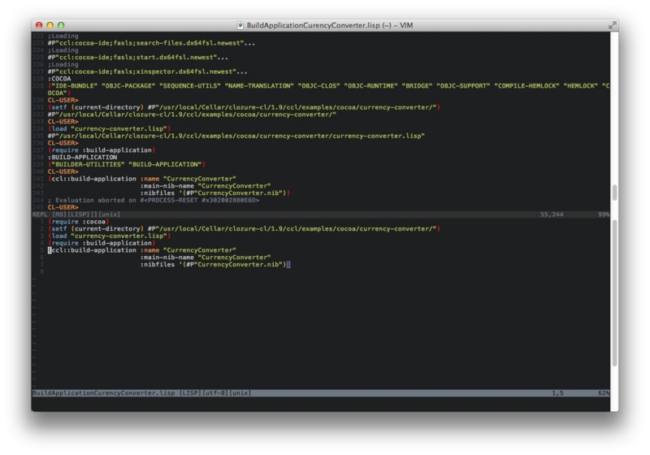

## Vim

[Slimv](http://www.vim.org/scripts/script.php) é um ambiente Common Lisp completo
dentro do Vim.

[Vlime](https://github.com/l04m33/vlime) um ambiente Common Lisp completo
para Vim (e Neovim), similar ao SLIME para Emacs e ao SLIMV.

