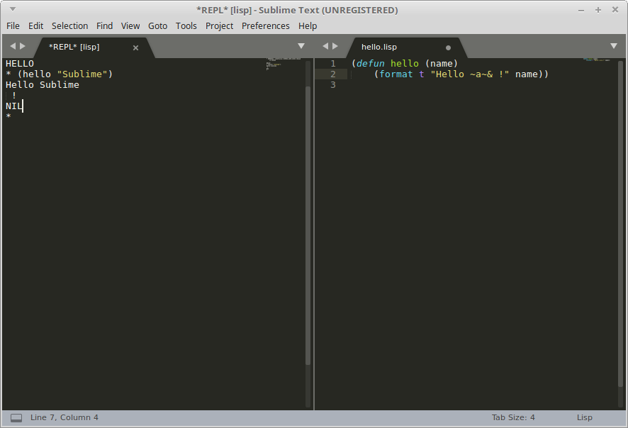

## Sublime Text

[Sublime Text](http://www.sublimetext.com/3) suporta um REPL Lisp e eval de código.

Você precisa instalar o pacote "SublimeREPL" e então escolher a implementação de CL em
Tools/SublimeREPL, e então `eval` o que você quiser.

